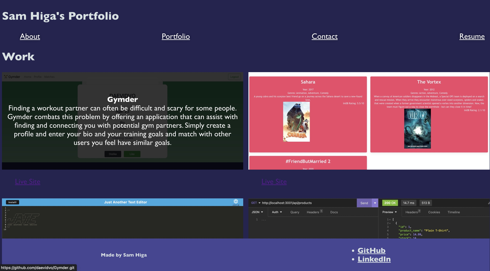

# react-portfolio

## Technology Used 
| Technology Used         | Resource URL           |  
| ------------- |:-------------:| 
| React    | [https://react.dev/](https://react.dev/) | 
| CSS     | [https://developer.mozilla.org/en-US/docs/Web/CSS](https://developer.mozilla.org/en-US/docs/Web/CSS)      |   
| Git | [https://git-scm.com/](https://git-scm.com/)     |    

## Description 

[Visit the Deployed Site](https://samhiga.github.io/react-portfolio/)

This webpage provides information me, including a short bio, my projects, how to get in touch with me, and a downloadable Resume. Intended for view and use by potential employers.

## Table of Contents 

* [Usage](#usage)
* [Learning Points](#learning-points)
* [Author Info](#author-info)
* [Credits](#credits)

## Usage 

The website is to be used to inquire more information on me for potential employers to see if I would be a good fit for thier company. They can view my bio, my work, and my contact information if they wish to learn more. the navigaion bar at the top can direct them to what they are looking for. A contact form is there if someone wants to get in touch with me, as well as view my Linkedin and Github accounts.

 

## Learning Points 

I got a better understanding of how react works with hands on experience.

## Author Info

### Sam Higa 

* [LinkedIn](https://www.linkedin.com/in/sam-higa-b887b9209/)
* [Github](https://github.com/samhiga)

---
